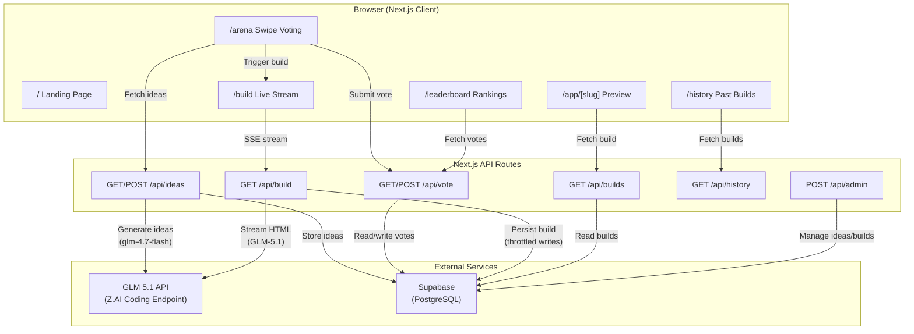
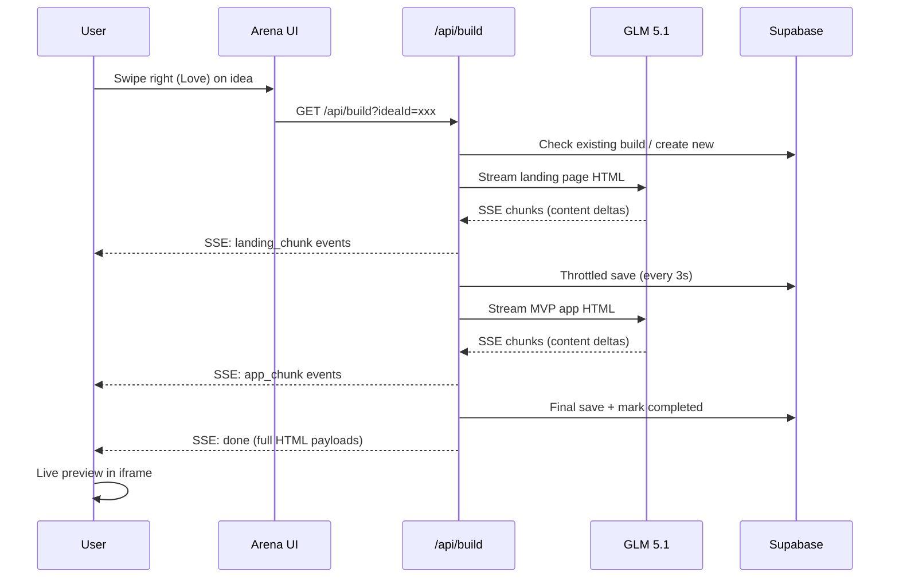

# VoteToShip

**Vote on web app ideas → the winner gets built live by GLM 5.1.**

VoteToShip is a community-driven web app where users swipe-vote on SaaS ideas and the crowd favorite gets shipped as a fully working prototype — generated in real time by [GLM 5.1](https://open.bigmodel.cn/).

🔗 **Live demo:** [votetoship.vercel.app](https://votetoship.vercel.app)

---

## Real-World Use Case

### Who is this for?

- **Indie hackers & builders** who want fast community validation before committing to an idea.
- **Hackathon teams** looking for a crowd-sourced direction for their next project.
- **Product communities** that want a fun, low-friction way to surface the best ideas.

### What problem does it solve?

Idea validation is slow. You write a pitch, share it on Twitter, wait for feedback, and repeat. VoteToShip compresses the entire cycle into minutes:

1. **Generate** — GLM produces 12 diverse, realistic SaaS concepts (or falls back to curated defaults).
2. **Vote** — The community swipes through ideas Tinder-style: Love (→) or X (←). No signup required.
3. **Ship** — Once an idea hits the vote threshold, anyone can trigger a live build. GLM 5.1 streams a complete landing page + interactive MVP app as standalone HTML files, right in the browser.

The result: a playable prototype the community actually asked for, built in under two minutes.

---

## System Design



### Data Flow: From Vote to Shipped App



---

## Architecture

### Tech Stack

| Layer | Technology | Purpose |
|-------|-----------|---------|
| **Framework** | Next.js 16 (App Router) | Server-side rendering, API routes, streaming |
| **Frontend** | React 19, Tailwind CSS 4 | UI components, swipe interactions |
| **Database** | Supabase (PostgreSQL) | Ideas, votes, builds, battle state |
| **AI Models** | GLM 5.1 (build) / GLM 4.7 Flash (ideas) | Code generation & idea generation |
| **Hosting** | Vercel | Edge deployment, serverless functions |
| **Analytics** | Vercel Analytics | Usage tracking |

### Project Structure

```
votetoship/
├── app/
│   ├── page.tsx              # Landing page (static marketing)
│   ├── layout.tsx            # Root layout (Inter font, analytics)
│   ├── globals.css           # Design system tokens & utilities
│   ├── arena/page.tsx        # Swipe-to-vote interface
│   ├── build/page.tsx        # Live build stream viewer
│   ├── leaderboard/page.tsx  # Vote rankings
│   ├── history/page.tsx      # Past completed builds
│   ├── app/[slug]/page.tsx   # Built app preview (iframe)
│   ├── admin/page.tsx        # Admin dashboard
│   └── api/
│       ├── ideas/route.ts    # GET active ideas / POST generate new batch
│       ├── vote/route.ts     # GET tallies / POST cast vote
│       ├── build/route.ts    # GET SSE stream (GLM 5.1 code generation)
│       ├── builds/route.ts   # GET recent builds list
│       ├── history/route.ts  # GET completed build history
│       ├── admin/route.ts    # POST admin actions (boost, delete, reset)
│       └── health/route.ts   # Health check
├── lib/
│   ├── glm.ts               # GLM API client (streaming + non-streaming)
│   ├── prompts.ts            # Prompt templates for idea generation
│   ├── store.ts              # Supabase data access layer
│   ├── supabase.ts           # Supabase client singleton
│   ├── admin.ts              # Admin token validation
│   ├── admin-client.ts       # Client-side admin token helper
│   └── constants.ts          # App constants (vote threshold)
└── supabase/
    └── schema.sql            # Database schema (5 tables + indexes)
```

### Database Schema

Five tables manage the entire application state:

| Table | Purpose |
|-------|---------|
| `app_state` | Tracks the current active battle ID |
| `idea_battles` | Groups of ideas generated per round |
| `ideas` | Individual SaaS ideas with title, description, source |
| `votes` | User votes with IP+token deduplication |
| `builds` | Generated HTML output, status, reasoning |

### Key Design Decisions

- **Two-phase build:** Each build generates two separate HTML documents — a marketing landing page and an interactive MVP app — streamed sequentially through a single SSE connection.
- **Throttled persistence:** Build output is saved to Supabase every 3 seconds (not per-chunk) to avoid bottlenecking the stream with hundreds of database round-trips.
- **Swipe UX:** The arena uses pointer events with drag thresholds for a native-feeling swipe interaction on both mobile and desktop.
- **Fallback ideas:** If the GLM idea generation call fails, the app falls back to a curated set of 12 realistic SaaS ideas so the experience never breaks.
- **Build resume:** If a user opens a build that's already in progress (started by someone else), they join the live stream via polling rather than triggering a duplicate build.
- **IP + token deduplication:** Votes are deduplicated using a SHA-256 hash of the user's IP address and a client-generated token, preventing ballot stuffing without requiring authentication.

---

## Why GLM 5.1?

GLM 5.1 is the core engine that makes VoteToShip possible. Here's why it was chosen over alternatives:

### 1. Long-Context Code Generation
GLM 5.1 generates complete, production-quality HTML documents (often 500+ lines) with Tailwind CSS and vanilla JavaScript in a single pass. The model handles the full spectrum — semantic HTML structure, responsive layouts, interactive JavaScript logic, and cohesive visual design — without needing multi-turn conversations or code assembly.

### 2. Streaming with Reasoning
The Z.AI API supports server-sent event streaming with separate `reasoning_content` and `content` deltas. This lets us show the model's thinking process in the UI while only extracting the final HTML output for the build — giving users transparency into *how* the app is being designed.

### 3. Multi-Step Agentic Workflow
A single build invocation triggers a multi-step pipeline:
1. **Vote analysis** — Determines which idea crossed the vote threshold.
2. **Landing page generation** — Creates a polished marketing page for the winning concept.
3. **MVP app generation** — Builds an interactive, functional prototype of the same concept.

Each step uses tailored prompts with specific constraints (compact output, no external dependencies, complete HTML documents), demonstrating GLM 5.1's ability to follow complex, multi-step instructions reliably.

### 4. Fast Idea Generation with GLM 4.7 Flash
Idea generation uses the lighter `glm-4.7-flash` model for speed and cost efficiency — generating 12 structured SaaS ideas in JSON format in under 3 seconds. This keeps the arena snappy while reserving the full GLM 5.1 for the heavier code generation task.

---

## Getting Started

### Prerequisites

- Node.js 18+
- A [Supabase](https://supabase.com) project (free tier works)
- A [Z.AI / GLM](https://open.bigmodel.cn/) API key

### 1. Clone and install

```bash
git clone https://github.com/mikaelaldy/votetoship.git
cd votetoship
npm install
```

### 2. Set up the database

Run the SQL in [`supabase/schema.sql`](supabase/schema.sql) in your Supabase SQL editor. This creates 5 tables, 4 indexes, and 1 helper function.

### 3. Configure environment variables

Create a `.env.local` file:

```env
GLM_API_KEY=your_glm_api_key_here
SUPABASE_URL=https://your-project.supabase.co
SUPABASE_SERVICE_ROLE_KEY=your_service_role_key_here
ADMIN_TOKEN=your_admin_token_here   # optional, defaults to "mikacend-demo"
```

### 4. Run locally

```bash
npm run dev
```

Open [http://localhost:3000](http://localhost:3000).

### 5. Deploy to Vercel

```bash
npx vercel
```

Set the same environment variables in your Vercel project settings.

---

## API Reference

| Endpoint | Method | Description |
|----------|--------|-------------|
| `/api/ideas` | `GET` | Returns the current batch of active ideas |
| `/api/ideas` | `POST` | Generates a fresh batch of 12 ideas via GLM |
| `/api/vote` | `GET` | Returns vote tallies for all active ideas |
| `/api/vote` | `POST` | Casts a vote (`{ ideaId, direction, voterToken }`) |
| `/api/build?ideaId=xxx` | `GET` | Streams a live build via SSE (landing + MVP app) |
| `/api/builds` | `GET` | Lists recent builds (all statuses) |
| `/api/history` | `GET` | Lists completed builds |
| `/api/admin` | `POST` | Admin actions (boost, delete, reset) — requires `x-admin-token` header |
| `/api/health` | `GET` | Health check |

---

## License

MIT

---

Built by [@mikaelbuilds](https://twitter.com/mikaelbuilds) for the [Build with GLM 5.1 Challenge](https://open.bigmodel.cn/).
